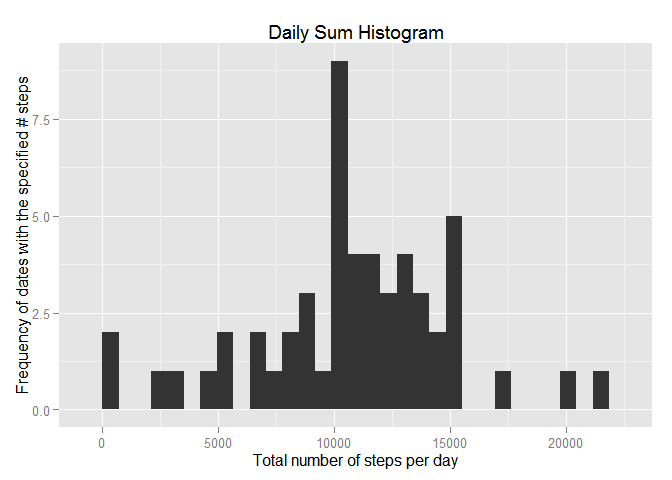
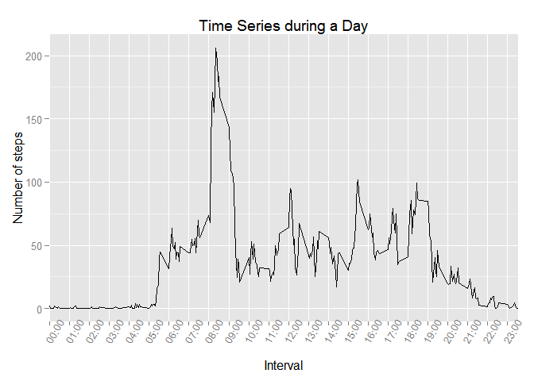
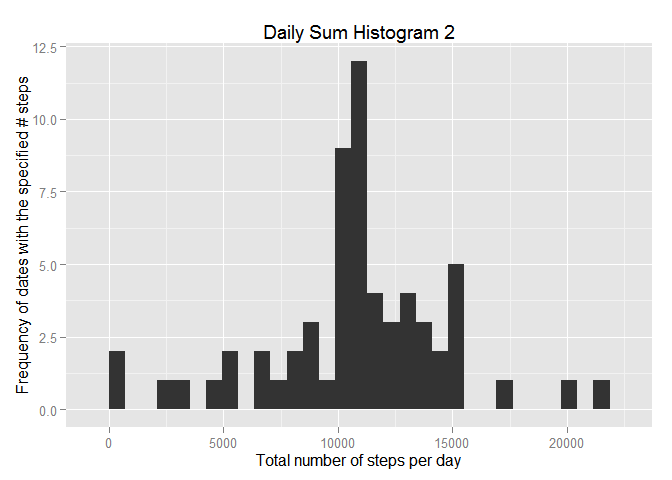

# Reproducible Research: Peer Assessment 1
Sung Wook Paek  


## Loading and preprocessing the data
We set the global requirement and read the data using the read.csv() function. As described in the assignment description, there are three variables: steps(numeric), date(YYYY-MM-DD), and interval(numeric). By specifying these types in the colClasses argument, we performed preprocessing at the same time.


```r
library(knitr)
opts_chunk$set(echo = TRUE, results = 'hold')
steps_data <- read.csv("activity.csv", colClasses = c("numeric", "Date", "numeric"))
```

## What is mean total number of steps taken per day?

We first calculate the number of steps per day by aggregating steps taken on the same date.

```r
steps_per_day <-
  aggregate(formula = steps~date, data = steps_data,
            FUN = sum, na.rm=TRUE)
mean_steps <- mean(steps_per_day$steps)
median_steps <- median(steps_per_day$steps)
```
The mean is 10766.2 (steps) and the median is 10765 (steps), which can also be shown from the histrogram below.


```r
library(ggplot2)
histogram <- qplot(x=steps, data=steps_per_day) +
  labs(title = "Daily Sum Histogram", x='Total number of steps per day', y='Frequency of dates with the specified # steps')
plot(histogram)
```

 

## What is the average daily activity pattern?
We plot 288 5-min intervals (288 x 5 min = 24 hrs) averaged across all days. The activity pattern imlies that the subject goes to bed around 11 pm and wakes up at 5 am, between which no activity exists. There is a continous high activity interval between 8 am and 9 am, and the interval at number 835 (which means 08:35) had the maximum value of 206 steps. The activity stays low for the remainder of morning, followed by intermittent medium activities (100 steps per interval) at noon, 3:30 pm, and 6 pm. After that activity decreases monotonouly throught the rest of evening.


```r
steps_per_interval <-
  aggregate(formula = steps~interval, data = steps_data,
            FUN = mean, na.rm=TRUE)

time_lab    = c('00:00', '01:00', '02:00', '03:00', '04:00', '05:00', '06:00',
                '07:00', '08:00', '09:00', '10:00', '11:00', '12:00', '13:00',
                '14:00', '15:00', '16:00', '17:00', '18:00', '19:00', '20:00',
                '21:00', '22:00', '23:00', '00:00')

ggplot(steps_per_interval, aes(x = interval, y = steps)) + geom_line() + scale_x_discrete(labels = time_lab, breaks = seq(0, 2400, by = 100)) + theme(axis.text.x = element_text(angle = 60)) + labs(title = "Time Series during a Day", x = "Interval", y = "Number of steps")
```

 

```r
max_interval <- steps_per_interval[which.max(steps_per_interval$steps),]
```

## Imputing missing values
There are 2304 missing values (NA's). We will fill in the missing values using the mean during a corresponding interval. This does not affect the average (10776.2), but it shifts the median a little bit (from 10765 to 10776.2). The new historgram shows that the bin count containingthe average nearly doubled (from 10 to 18).

```r
missing_vals_count <- sum(is.na(steps_data$steps))
imp_data <- steps_data

for (i in 1:nrow(imp_data)){
        if(is.na(imp_data$steps[i])){
                imp_data$steps[i] <- steps_per_interval[which(steps_per_interval$interval == imp_data$interval[i]),]$steps
}
}

# Repeat same analysis
steps_per_day2 <-
  aggregate(formula = steps~date, data = imp_data, FUN = sum, na.rm=TRUE)

mean_steps2 <- mean(steps_per_day2$steps)
median_steps2 <- median(steps_per_day2$steps)

histogram2 <- qplot(x=steps, data=steps_per_day2) +
  labs(title = "Daily Sum Histogram 2", x='Total number of steps per day', y='Frequency of dates with the specified # steps')
plot(histogram2)
```

 

## Are there differences in activity patterns between weekdays and weekends?
As shown below, on weekends the activity is more evely distributed over the daytime and early evening, whereas on weekdays the activity is more heavily concentrated in early morning. This might suggest the subject's sports activities such as jogging which result in a high number of steps. On weekends, the number of steps remains high throughout daytime, so the subject may be participating in light outdoor activities.


```r
data_weekend <- subset(imp_data, weekdays(date) %in% c("Saturday", "Sunday"))
data_weekday <- subset(imp_data, !weekdays(date) %in% c("Saturday", "Sunday"))

# Obtain the average steps per interval for each dataset
data_weekend <- aggregate(steps ~ interval, data_weekend, mean)
data_weekday <- aggregate(steps ~ interval, data_weekday, mean)

data_weekend <- cbind(data_weekend, day = rep("weekend"))
data_weekday <- cbind(data_weekday, day = rep("weekday"))
data_week    <- rbind(data_weekend, data_weekday)
levels(data_week$day) <- c("Weekend", "Weekday")

ggplot(data_week, aes(x=interval, y=steps)) + 
        geom_line(color="steelblue", size=1) + 
        facet_wrap(~ day, nrow=2, ncol=1) +
        labs(x="Interval", y="Number of steps") +
        theme_bw() + 
        scale_x_discrete(labels = time_lab, breaks = seq(0, 2400, by = 100)) +
        theme(axis.text.x = element_text(angle = 60))
```

 
